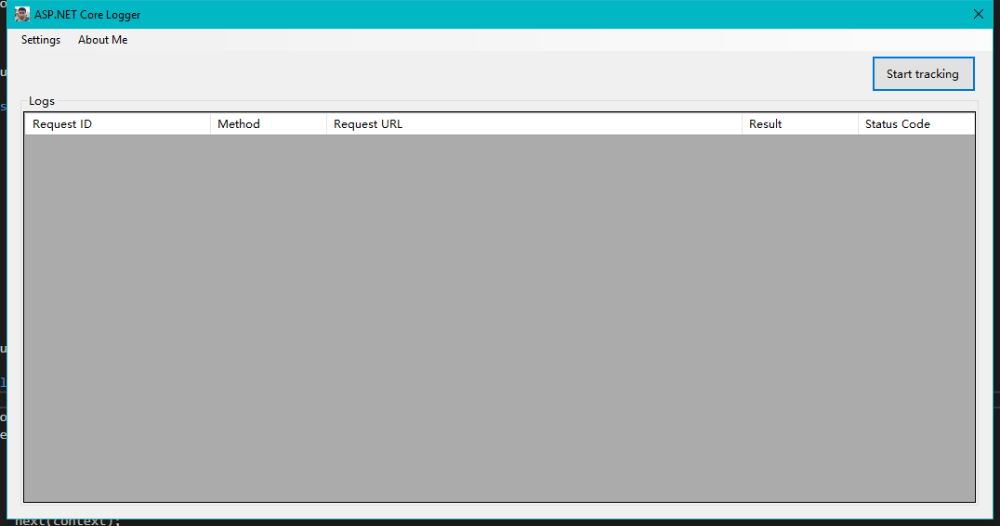
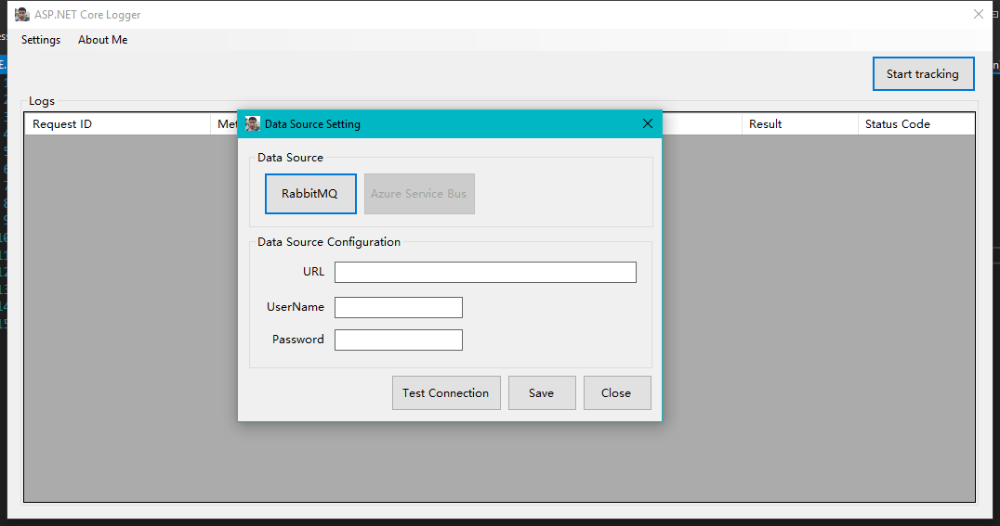

# ASP.NET Core WebApi Logger v1.0
a WebApi Logger based on ASP.NET Core, which can tracking asp.net core webapi request/response in a winform application via RabbitMQ



## Supported Message Queue
 - RabbitMQ
 - Azure Service Bus(Release in 2.0 version)

## How to configure the host?
1. You need to add the reference for `WebApiLogger.Core` and `WebApiLogger.Host`
2. Register the ILoggerData in the DI and load the config

```
services.AddScoped<ILoggerData, LoggerData>();
services.AddOptions();
services.Configure<LogSetting>(Configuration.GetSection("LogSettings"));
```

3. Use the `LoggerMiddleware`

```
	public void Configure(IApplicationBuilder app, IHostingEnvironment env)
    {
        app.UseMiddleware<LoggerMiddleware>();

        if (env.IsDevelopment())
        {
            app.UseDeveloperExceptionPage();
        }

        app.UseMvc();
    }
```


## How to configre the client?


